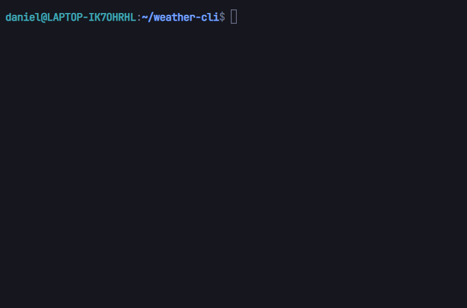

# :cloud: Weather CLI

Simple CLI made with Go, it interacts with the OpenWeather's [Current API](https://openweathermap.org/current)

## :arrow_forward: Demo:



## :gear: Running locally:

- Download
```bash
git clone https://github.com/ddanielsantos/weather-cli
cd weather-cli
```
- Setup your OpenWeather API Key

You can get more information about the API Key [here](https://openweathermap.org/appid), after you get one, you can use ``.env.example`` as a model to finish the configuration

- Run
```bash
go build .
./weather-cli now --city <city name here>
```

## :pencil: TODO:

- [ ] implement commands: 
  - [X] now
  - [ ] forecast (using OpenWeather's [Forecast16 API](https://openweathermap.org/forecast16))

## :thinking: Knowledge obtained:

- Get requests with ``net/http``
- Environment variable management
- Marshall, Unmarshall and Indent with ``encoding/json``
- ``cobra-cli``  basic usage